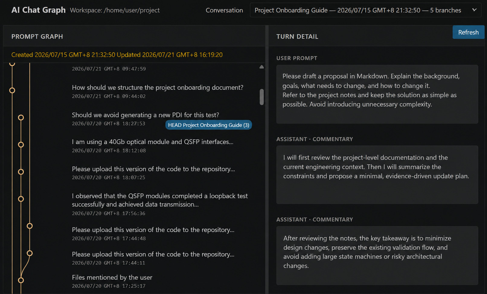

# AI Chat Graph v0.1.4

AI Chat Graph is `git log --graph` for Codex conversations. It is a read-only VS Code workspace extension that loads stored Codex threads through the official `codex app-server` stdio JSONL transport, groups related threads by `sessionId`, and renders each user turn as a node in a deterministic fork graph.

Source code: [github.com/xuanzhengyang/ai-chat-graph](https://github.com/xuanzhengyang/ai-chat-graph)

## Preview



## Features

- Resolves the active VS Code workspace folder and applies an exact `cwd` filter.
- Reads non-archived `cli` and `vscode` threads with cursor pagination.
- Merges copied fork history with a parent-scoped Prefix Trie.
- Follows `forkedFromId` ancestry when forked threads use independent `sessionId` values.
- Loads only archived threads that are required as lineage ancestors and marks their heads as archived.
- Uses turn IDs first and visible User/Assistant content as the copied-ID fallback.
- Marks every loaded thread head and shows complete User/Assistant text on click.
- Shows real Thread and Turn timestamps from Codex, orders conversations and prompts newest first, and shows each Turn Detail chronologically with the User Prompt first.
- Places each Prompt timestamp below its text and provides a draggable divider between Prompt Graph and Turn Detail.
- Runs as a workspace extension, so Remote SSH starts `codex app-server` on the remote Extension Host.
- Uses only TypeScript, Node.js, HTML, CSS, SVG, and vanilla JavaScript.

AI Chat Graph does not call any Codex write method. Its app-server request allowlist contains only `initialize`, `thread/list`, and `thread/read`; `initialized` is the required notification.

## Requirements

- VS Code 1.90 or newer.
- A `codex` CLI executable available in the Extension Host `PATH`.
- For Remote SSH, install the extension on the SSH host and make `codex` available on that host.

## Build and test

```bash
npm install
npm test
npm run package
```

The package command creates `agentgraph-0.1.4.vsix`.

## Install

From a terminal associated with the target VS Code instance:

```bash
code --install-extension agentgraph-0.1.4.vsix
```

For Remote SSH, open the Extensions view in the remote window and install the VSIX into `SSH: <host>`.

## Use

1. Open a workspace folder in VS Code.
2. Run `AI Chat Graph: Open` from the Command Palette.
3. Choose a conversation tree, inspect the graph, and click any prompt node for its full turn.
4. Run `AI Chat Graph: Refresh` or use the in-panel Refresh button to reload history.

The AI Chat Graph output channel contains app-server diagnostics without sending conversation contents to telemetry or the network.

## Read-only probe

The probe prints normalized metadata and prompt previews for one exact workspace path:

```bash
npm run probe -- /absolute/workspace/path
```

It starts the same stdio client and calls only the read methods used by the extension. Observations from the implementation environment are recorded in `docs/probe-notes.md`.

## Known v0.1 limitations

- No search, database, cache, polling, live updates, AI summaries, Git provenance, or cross-workspace aggregation.
- No conversation resume, fork, archive, delete, rename, or any other write operation.
- Stored thread history only; ephemeral fork merging is not a v0.1 goal.
- If lineage metadata is unavailable, the affected thread is safely displayed as its own tree.
- A content fallback can only merge turns under the same canonical parent; branches never merge again after divergence.
- No HTTP server, WebSocket server, external CDN, frontend framework, native addon, or direct parsing of private `~/.codex` JSONL files.

## Privacy

Conversation data remains in memory in the Extension Host and Webview. AI Chat Graph does not upload it, persist a second copy, or call an LLM.

## License

MIT License. Copyright (c) 2026 xuanzhengyang.
